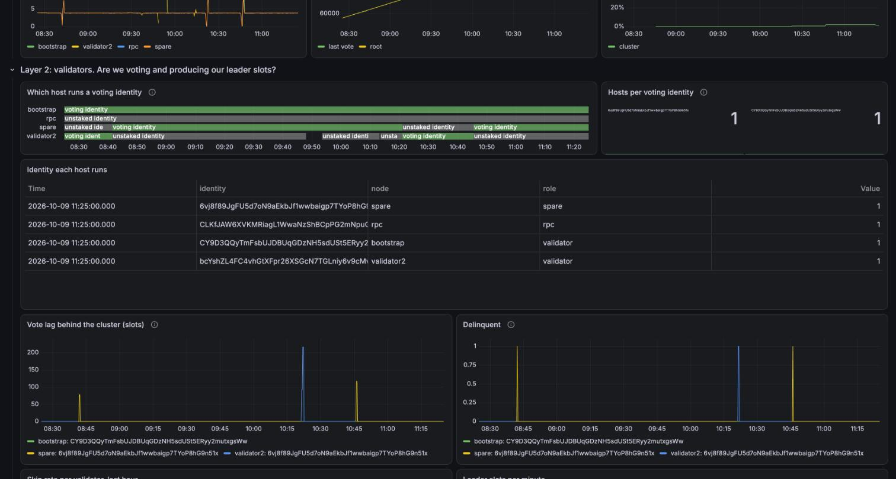
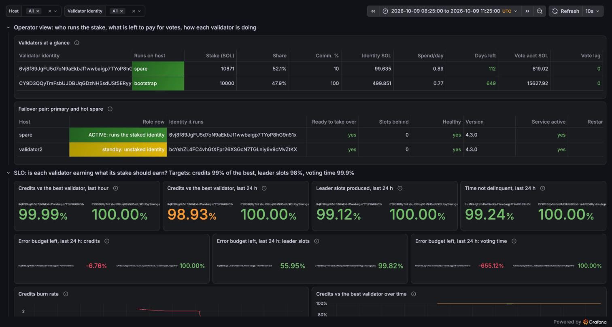

# solana-devnet-lab

[](https://github.com/terrydevops/solana-devnet-lab/actions/workflows/ci.yml)

A four-node Solana cluster on one machine, set up and operated the way a validator operator would:
Linux hosts with systemd, everything on them put there by Ansible, keys separated by role, a hot
spare with an identity-switch playbook, and a monitoring stack with tested alerts.

It is a lab for practising operations, not a way to run a validator. What was learned from running
it is in [`docs/lab-notes.md`](docs/lab-notes.md).

## Where to look first

| If you care about | Read |
|---|---|
| How an identity moves between two hosts without both ever voting | [The identity switch](#the-identity-switch) below, [`ansible/failover.yml`](ansible/failover.yml), and the [lab notes](docs/lab-notes.md) |
| Who holds which key, and what root on the hosts can and cannot do | [`docs/keys-and-access.md`](docs/keys-and-access.md), including the safeguards against double voting on Agave and Firedancer |
| What gets paged, what waits, and what to do when it fires | [`alerts.yml`](monitoring/metrics/prometheus/alerts.yml) and [`docs/runbooks.md`](docs/runbooks.md) |
| Why each signal is watched | [`docs/monitoring-rationale.md`](docs/monitoring-rationale.md) |
| What went wrong on the way | [`docs/lab-notes.md`](docs/lab-notes.md) |

## Architecture


All four nodes sync the chain. Only two of them are validators:

| Host | Syncs | Votes | Has stake | Produces blocks | Also |
|---|---|---|---|---|---|
| `bootstrap` | yes | yes | yes, 10,000 SOL written into genesis | yes | Started the chain and stands in for the rest of the network. No spare: if it stops, the chain stops |
| `validator2` | yes | yes | yes, delegated by three delegator wallets | yes | The validator operated the production way: withdraw authority offline, hot spare, failover |
| `spare` | yes | no | no | no | Ready to take over validator2's identity |
| `rpc` | yes | no | no | no | Keeps transaction history, answers queries |

Only `validator2` and `spare` are run like a production validator. `bootstrap` is a simplification:
its stake and its keys come from the genesis ceremony and its authorities sit on its own online
identity, which no real operator would accept.

The diagram is generated: `python3 docs/build-architecture.py`.

## The identity switch

The drill this lab was built around: move a staked identity from the primary to the hot spare
and back, without restarting either host and without both ever being able to vote.

```bash
scripts/failover.sh --check      # where the pair stands; changes nothing
scripts/failover.sh              # switch to whichever host is the standby right now
scripts/failover.sh validator2 spare      # or name both hosts yourself
```

Without host names it asks both hosts which identity they run, and switches only if exactly one
holds the staked identity and the other is running and caught up:

```
$ scripts/failover.sh --check
  validator2   standby  runs bcYshZL4..., 0 slots behind, service active
  spare        ACTIVE   runs the staked identity, 0 slots behind, service active
  the standby is ready: a switch would go spare -> validator2
```

If the standby is not ready it says why and stops. If both hosts run the staked identity, or
neither does, it stops and says that a person has to decide.

A real run (2026-10-09, spare to validator2; times removed):

```
$ scripts/failover.sh
preflight: both hosts hold the same staked key ...  ok
preflight: the old host holds the staked identity, the new host does not ...  ok
preflight: both hosts run the same version ...  ok
preflight: the new host is caught up ...  ok
preflight: the new host can sign votes for the identity ...  ok
0 + 1. wait for a window without leader slots, then the old host lets go ...  changed
2 + 3. the tower arrives and is verified, then the new host takes over ...  changed
4. identity.json follows the new roles ...  changed
verify: the identity has voted on a slot produced after the switch ...  ok
verify: the identity is on the new host and on no other ...  ok

  identity 6vj8f89J... moved spare -> validator2
  window: slot 99016, next leader slot 99036, 20 slots idle (wanted 20, waited 45 slots)
  nobody held the identity for 0.48 seconds
  tower: tower-1_9-6vj8f89J....bin, sha256 dedf54d6043d652e..., verified on validator2
  cluster tip at the takeover 99017, the identity has now voted on 99215
```

The switch itself is two calls to the validator's own `set-identity`, in the order the Anza
failover guide gives. Around them the playbook ([`ansible/failover.yml`](ansible/failover.yml)) adds:

| Step | What | Why |
|---|---|---|
| preflight | Same staked key on both hosts, roles as expected, same version, standby caught up, vote-signing key loaded | A switch should fail before it starts, not in the middle |
| 0 | Wait for a gap in the leader schedule ([`wait-for-leader-gap.py`](ansible/files/wait-for-leader-gap.py)) | `wait-for-restart-window` counts in minutes; a validator with a large share never gets one |
| 1 | The old host lets go: `set-identity` to its unstaked key | The old host first, always: never two hosts on one identity |
| 2 | The tower file moves, with a sha256 check | The record of what this identity has voted for |
| 3 | The new host takes over: `set-identity --require-tower` | Refused without the tower |
| 4 | `identity.json` follows, inside the same commands as steps 1 and 3 | What each host is after a restart: a host that has let go and then crashes must not come back with the staked key |
| rollback | If step 3 fails, the old host takes the identity back | Otherwise nobody holds it |
| verify | The identity has voted on a slot produced after the switch, and runs on the new host only | "The command returned 0" is not proof |

What the runs measured:

| Run | Share of stake | No holder for | What it cost |
|---|---|---|---|
| 2026-10-08, first | about 10% | 1.92 s | The spare could not sign votes for 88 s: the vote-signing key was not loaded. The playbook said "success" |
| 2026-10-08, fixed | about 10% | 2.01 s | 4 leader slots skipped, no alert |
| 2026-10-09 13:17 | 33% | 1.72 s | Not measured |
| 2026-10-09 19:41 | 40% | 0.43 s | Votes took about 40 s to land again; finality paused cluster-wide for about 50 s |
| 2026-10-09 21:18 | about 45% | 0.43 s | Waited 508 slots for a 20-slot gap; vote lag paged at 92 slots |
| 2026-10-09 22:24 | about 45% | 0.48 s | 128 of the identity's 510 leader slots in that epoch skipped |
| 2026-10-10 09:42, new chain | 9% | 0.44 s | Nothing: no leader slot skipped, vote lag 0 |
| 2026-10-10 09:46 | 9% | 0.42 s | Nothing |

Read the table by the share of stake. At 9% a switch costs nothing that the monitoring can see.
At 40% and more the time between the two commands is the same half second, but votes took tens of
seconds to land again, finality paused for the whole cluster and a quarter of an epoch's leader
slots went missing. That share cannot occur on a real network; it built up here because rewards
compound. Why the new host needs that long in that situation is not yet understood.
Details: [lab notes](docs/lab-notes.md).

What three of those switches look like from the monitoring (2026-10-09, times in UTC): the green
bar is the staked identity passing between `validator2` and `spare`, and under it the vote lag and
the delinquent mark each switch produced.



### When the primary cannot be reached

A switch needs the old host's cooperation. When that host is gone, or only looks gone, the spare
has to take the identity without it, and the one thing that must not happen is that both vote.
[`ansible/takeover.yml`](ansible/takeover.yml) follows the Anza guide for that case:

```bash
scripts/fence.sh spare                                              # 1. a person cuts the host off, from outside
ansible-playbook takeover.yml -e from=spare -e to=validator2 -e fenced=yes
# 2. the identity's last vote must stand still   3. the cluster must finalize past it
# 4. take the identity; a tower left by an earlier switch is set aside   5. votes must land again
scripts/fence.sh --lift spare                                       # refused while the host still holds the identity
```

Rehearsed once, on 2026-10-10, with the active host cut off from the network while it kept running:

| | |
|---|---|
| Without `-e fenced=yes` | The playbook refuses and says why |
| First attempt, right after the fence | **Refused by step 2:** the old host's last vote still moved, from slot 1586 to 1614, in the twenty seconds after it was cut off. Votes signed before the fence were still landing |
| Second attempt | Last vote stood still at 1614; the cluster had finalized 1810; identity taken; voting again on new slots 15 s later. The playbook took 39 s, 20 of them watching |
| From fence to verified votes | About 77 s, including the refused attempt. 16 leader slots skipped. The identity held 9% of the stake |
| Tower | None from the old host. The validator logged "Creating a new tower from bankforks"; the copy left on this host by an earlier switch had been set aside |
| Alerts | `VotingIdentityNotHeld` (p1), and `NodeDown` as **p1** for the fenced host: the rule still knew it had carried the staked identity. `CreditsBudgetFastBurn` (p1) fired afterwards, the first SLO alert to fire here |
| The fenced host | Still ran the staked identity, as its console showed. Lifting the fence was refused until it was put on its unstaked key; then it rejoined as a standby in 26 s without a restart |
| Afterwards | A normal switch in the other direction: 0.42 s, nothing skipped |

Not rehearsed: a host that is powered off instead of cut off, a host that comes back by itself, and
a takeover of an identity with more than a third of the stake, where step 3 would wait forever.


## What is in it

| Part | What it does |
|---|---|
| `hosts/` | Four "servers": systemd containers with fixed addresses and separate volumes for ledger, accounts and snapshots |
| `image/` | Builds Agave v4.3.0 from source for linux/arm64 (there is no official arm64 build) |
| `ansible/` | Host preparation, genesis, joining a validator, a non-voting RPC node, delegating stake, the hot spare, identity failover, a reset, and the monitoring agents |
| `monitoring/` | Prometheus, Alertmanager, Grafana and Loki; alert rules in five layers; a generated dashboard; a unit test for the identity alerts |
| `scripts/disk-guard.sh` | Stops the validators before the shared disk is full |
| `docs/` | Keys and access, runbooks for every alert, why each signal is monitored, and the lab notes |
| `.github/` | CI: lint, workflow audit, secret scan, image CVE scan |

The nodes:

| Host | Address | Role |
|---|---|---|
| `bootstrap` | 172.30.0.11 | Genesis validator, votes |
| `validator2` | 172.30.0.12 | Joins with delegated stake, votes; primary of the failover pair |
| `rpc` | 172.30.0.13 | Non-voting, transaction history; published to the host at `127.0.0.1:8999` |
| `spare` | 172.30.0.14 | Hot spare: follows the chain with an unstaked identity |

## How it maps to production practice

| Production practice | Here |
|---|---|
| A Linux host per validator | One systemd container per node (Ubuntu 24.04, privileged, cgroup v2) |
| Validator as a systemd service under its own user | Unit file and `sol` user installed by a role |
| Start-up flags kept in a start script | Templated `validator.sh`, one flag per line |
| Host tuning | The role sets sysctls and file limits, then reads them back from the live kernel |
| Ledger, accounts and snapshots on separate drives | Three volumes per host |
| Key separation | Identity on the host; withdraw authority of the vote account and all delegator keys only on the control machine (`ansible/secrets/`, not in the repository) |
| Trust anchors on join | `--known-validator`, `--expected-genesis-hash`, `--only-known-rpc` |
| Voting validators and RPC nodes kept apart | `rpc` runs `--no-voting` |
| Upgrades and failures handled by an identity switch | `spare.yml` and `failover.yml`: preflight checks, a wait for a window without leader slots, the old host lets go, the tower file moves with a checksum, the new host takes over; a failed takeover is rolled back |
| Monitoring agents on the hosts | `node_exporter`, a chain exporter and a log shipper as systemd services |

## Running it

Needs Docker, Ansible with the `community.docker` and `ansible.posix` collections, and the Solana
CLI of the same version on the control machine, unpacked to `.release/solana-release/` (the
playbooks call it from there). Built and run on Apple Silicon with Docker Desktop; allow a few
hundred GB of disk for the Docker VM.

```bash
# 1. Build Agave once and put the binaries where the role expects them (takes a while)
docker build -t agave-arm64:v4.3.0 --build-arg AGAVE_TAG=v4.3.0 image/
cid=$(docker create agave-arm64:v4.3.0)
docker cp "$cid:/usr/local/bin/." ansible/files/bin/ && docker rm "$cid"
monitoring/exporter/build.sh

# 2. Hosts
(cd hosts && docker compose up -d)

# 3. Cluster
cd ansible
ansible-playbook site.yml --tags host,binaries
ansible-playbook genesis.yml          # then put the printed genesis hash into group_vars/solana.yml
ansible-playbook site.yml --tags service --limit bootstrap -e solana_start=true
ansible-playbook join.yml --limit validator2
ansible-playbook join-nonvoting.yml
ansible-playbook spare.yml
ansible-playbook site.yml --tags service --limit validator2:rpc:spare -e solana_start=true
ansible-playbook stake.yml --limit validator2

# 4. Monitoring
ansible-playbook monitoring.yml
(cd ../monitoring && docker compose up -d)
```

Alerts are delivered to a local sink that only logs them, so nothing reaches a person by itself.
`scripts/alerts-watch.sh` follows that log in a terminal and raises a desktop notification for
each p1 and p2.

Grafana is at http://127.0.0.1:3100 (`admin` / `admin`, bound to localhost), Prometheus at
http://127.0.0.1:9190, Alertmanager at http://127.0.0.1:9193.

```bash
export PATH=$PWD/.release/solana-release/bin:$PATH      # from the repository root
solana -u http://127.0.0.1:8999 validators
solana -u http://127.0.0.1:8999 stakes <vote account>

# Move the staked identity to the other host of the pair, without restarting either one.
# It asks both hosts which identity they run and switches only if exactly one holds the staked
# identity and the other is running and caught up. Each step is printed as it happens.
scripts/failover.sh --check      # where the pair stands; changes nothing
scripts/failover.sh              # switch to whichever host is the standby right now

# Start over: wipes ledger, accounts and snapshots on every host, keeps the keys
ansible-playbook reset.yml -e confirm=yes
```

The ledger grows by tens of GB per hour with four nodes. Run `scripts/disk-guard.sh &`, and stop
the validators when the cluster is not in use:

```bash
for h in bootstrap validator2 rpc spare; do docker exec sol-$h systemctl stop sol; done
```

Do not recreate the host containers once they are set up: keys and installed binaries live in the
container's own filesystem, only `/mnt/*` is on volumes.

## Monitoring



The top of the dashboard on the evening of 2026-10-09: which host runs each identity, what is left
to pay for votes, the failover pair, and the service level objectives. The orange and red tiles are
real: that validator had spent the day being stopped and switched.


| Layer | Question | Rules |
|---|---|---|
| 1. Cluster | Is the chain moving and agreeing? | `ClusterRootStalled`, `ClusterSkipRateHigh` |
| 2. Validators | Are we voting, voting well, and producing our leader slots? | `ValidatorDelinquent`, `ValidatorVoteLagging`, `ValidatorRootStalled`, `ValidatorCreditsBehind`, `ValidatorSkipRateHigh`, `ValidatorStakeDropped`, `ValidatorStakeShareDropped`, `VotingIdentityOnTwoHosts`, `VotingIdentityNotHeld` |
| 3. Funds | Can we still pay for votes? | `IdentityBalanceRunningOut`, `IdentityBalanceLow` |
| 4. Node | Is each node healthy and caught up? | `NodeUnhealthy`, `NodeFallingBehind`, `NodeSlotStalled`, `NodeVersionMismatch` |
| 5. Foundation | Is any of this being measured, and is the host fine? | `NodeDown`, `MonitoringTargetDown`, `HostAgentDown`, `HostDiskWillFillSoon`, `HostDiskSpaceLow`, `HostMemoryLow`, `ValidatorServiceRestarting`, `ValidatorServiceNotActive` |

Three priorities, by what happens if nobody acts:

| Priority | Meaning | Examples |
|---|---|---|
| p1 | Page now, at any hour: rewards or reputation are being lost | Identity on two hosts or on none, validator delinquent or not voting, the process dead on the host that runs a staked identity, identity balance nearly empty |
| p2 | Tell the on-call now, do not wake them: the margin is gone or part of the monitoring is blind | The same process dead on the spare or the RPC node, the disk full within a day, the balance empty within three days, an exporter down |
| p3 | A ticket for working hours | Skip rate, credits behind the best validator, stake or stake share falling, version mismatch |

The same fault has a different priority on different hosts. Whether a host "runs a staked identity"
is remembered for ten minutes, because the host that dies takes that information with it; a unit
test covers exactly that case. Inhibit rules make the cause page and keep its symptoms quiet.
The stack also watches itself: a dead exporter looks exactly like a quiet system.

The dashboard opens with one table, a row per validator: the host that runs the identity right
now, stake and share, the identity balance with what it spends per day and how many days that
lasts, the commission waiting in the vote account, vote lag, credits against the best validator
and skip rate. Under it, the failover pair side by side: which host is active, which is standby,
and whether the standby could take over right now. After a switch the two rows trade places.

Two dropdowns at the top filter every panel by host and by validator identity. The validator
graphs carry the host that runs the identity in their legend, so a failover shows in each of them
as the line passing from one host to the other.

### Service level objectives

The alert layers say what is broken. The SLO row says whether a validator is doing what its
delegators are paid on, over time and against a target.

| Objective | Indicator | Target | Error budget |
|---|---|---|---|
| Credits | Vote credits earned, as a share of what the best validator in the cluster earned | 99% | 1% of credits |
| Leader slots | Leader slots in which a block was produced | 98% | 2% of leader slots |
| Voting time | Time not marked delinquent | 99.9% | 86 seconds a day |

The dashboard shows each indicator, how much of the last 24 hours' budget is left, and the burn
rate. Alerts use two windows at once: a fast burn (14.4 times too fast over 5 minutes and over an
hour) is p1, a slow burn (6 times over 30 minutes and over 6 hours) is a ticket. The targets are
placeholders; real ones come from what delegators are promised. The budget window is a day
instead of the usual 30 because this cluster is reset every day or two.

On the day it was added the staked identity of `validator2` showed 98.68% of the best validator's
credits over 24 hours and 98.74% of the time not delinquent: both targets missed, the price of a
day of stop tests and failover drills. That is what the row is for.

The reasoning behind each signal, with the numbers read off the running stack, is in
[`docs/monitoring-rationale.md`](docs/monitoring-rationale.md). The dashboard is generated:
`python3 monitoring/scripts/build-dashboard.py`.

Parts:

| Part | Where it runs | Installed by |
|---|---|---|
| `solana-exporter` v3.1.0 (community; no release binaries, built by `monitoring/exporter/build.sh`) | On each host, polling the local RPC. Light mode on the validators, full mode on the RPC node | `ansible/monitoring.yml`, role `solana_exporter` |
| `vote-credits-exporter.py` (ours) | On the RPC node | same role |
| `node_exporter` 1.12.1 with the systemd collector | On every host | role `node_exporter` |
| Alloy 1.20.1: validator log and `sol.service` journal | On each host that runs a validator | role `alloy` |
| Prometheus (7 days or 2 GB), Alertmanager, alert sink, Grafana, Loki (48 hours) | `monitoring/docker-compose.yml`, ports on localhost only | `docker compose up -d` |

## CI

`.github/workflows/ci.yml` is a gate, not a deployment pipeline. Nothing is deployed from CI: the
cluster lives on one machine and Ansible is run from that machine.

| Job | What it checks |
|---|---|
| lint | shellcheck, yamllint, actionlint, Python and Node syntax, `ansible-playbook --syntax-check` on every playbook, `promtool check rules` and the alert unit tests, that the committed dashboard matches its generator, that the compose files render, and that every image reference is pinned |
| zizmor | The workflows themselves: permissions, injection, unpinned actions |
| secrets | Trivy secret scan, with two extra rules for Solana keypairs (the 64-byte JSON array and the base58 form), which the built-in rules do not match |
| image scan | Every image the compose files use, listed by a script, scanned for fixable critical CVEs |

Actions are pinned to commit SHAs and tool images to digests; Dependabot moves the pins weekly. The
workflow token is read-only. An accepted CVE goes into `.trivyignore.yaml` with a reason and an
expiry date, and the weekly run fails when it expires.

Not covered: the images built here from `image/Dockerfile` and `monitoring/exporter/Dockerfile`
are not scanned, and their base images are not pinned by digest.

## Not done

Said plainly, because a lab invites the assumption that it covers more than it does.

- **An upgrade across versions.** Only one Agave version is built here, so "upgrade the spare, switch,
  upgrade the old primary" has been done as a switch, never with two binaries.
- **Running out of identity balance.** The alerts exist; the drill has not been run.
- **Secrets handling.** The withdraw authority and the delegator keys are plain files on the control
  machine. No hardware wallet, no multisig, no encryption at rest.
- **Host hardening.** The hosts are privileged containers without firewall rules.
- Several alerts have never fired on the cluster; [`docs/runbooks.md`](docs/runbooks.md) says which.

## Some things running it showed

Details and the rest are in the [lab notes](docs/lab-notes.md).

- **A playbook can report a successful failover while nobody votes.** `set-identity` moves the
  identity but not the key that signs votes, and the first success check was satisfied by the old
  host's last votes. The spare did not vote for 88 seconds; the monitoring noticed, the playbook
  did not. After the fix a switch left the identity unheld for under two seconds; with the window
  wait and the two halves each run as one command, 0.43 seconds. That is the gap between two
  commands, not the outage: in the same run votes took about 40 seconds to land again and
  finality paused for the whole cluster, because the identity held 40% of the stake.
- **`Restart=on-failure` hides a crash loop.** When the disk filled, systemd restarted one service
  4,102 times and everything looked "active". Hence an alert on the restart count.
- **The ledger limit does not protect a small disk.** The smallest value Agave 4.3 accepts is 100
  million shreds, about 120 GB per node. The ledger is almost entirely shreds, half of them
  erasure coding.
- **"Voting" is not "earning".** The community exporter has no vote credits, so a small exporter was
  added: a validator that votes late is never delinquent and still earns less than its peers.
- **Which host holds the identity needs its own alerts.** Every other signal follows the vote
  account and is satisfied as long as somebody votes. Two rules cover an identity on two hosts and
  an identity on none; the second fired 35 seconds after the identity was taken away, ahead of the
  delinquency alert.
- **Stake compounds.** 1,000 SOL delegated to the second validator grew by itself every epoch
  while the bootstrap validator's stake stood still, so the share of leader slots drifts.

## Limits

- Firedancer cannot run here: it needs XDP, huge pages and bare-metal Linux.
- Containers as hosts share one kernel. Sysctls are global to the Docker VM, NUMA and NIC tuning do not
  apply, and timing is not representative.
- A development cluster uses `--hashes-per-tick sleep`, so proof of history does not load the CPU.
  Nothing measured here says anything about mainnet performance.
- No block-building integration (Jito, BAM, Harmonic) and no real transaction load: the blocks hold
  votes and little else.
- Several observations in the notes have no confirmed cause yet. They are marked as such.

## License

MIT. See [`LICENSE`](LICENSE).
