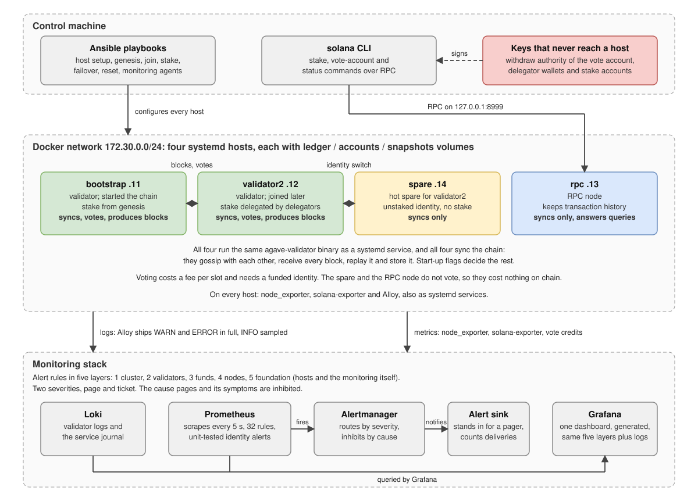

# solana-devnet-lab

A four-node Solana cluster on one machine, set up and operated the way a validator operator would:
Linux hosts with systemd, everything on them put there by Ansible, keys separated by role, a hot
spare with an identity-switch playbook, and a monitoring stack with tested alerts.

It is a lab for practising operations, not a way to run a validator. What was learned from running
it is in [`docs/lab-notes.md`](docs/lab-notes.md).

## Architecture



All four nodes sync the chain. Only two of them are validators:

| Host | Syncs | Votes | Has stake | Produces blocks | Also |
|---|---|---|---|---|---|
| `bootstrap` | yes | yes | yes, from genesis | yes | Started the chain; the others join through it |
| `validator2` | yes | yes | yes, delegated | yes | Primary of the failover pair |
| `spare` | yes | no | no | no | Ready to take over validator2's identity |
| `rpc` | yes | no | no | no | Keeps transaction history, answers queries |

The diagram is generated: `python3 docs/build-architecture.py`.

## What is in it

| Part | What it does |
|---|---|
| `hosts/` | Four "servers": systemd containers with fixed addresses and separate volumes for ledger, accounts and snapshots |
| `image/` | Builds Agave v4.3.0 from source for linux/arm64 (there is no official arm64 build) |
| `ansible/` | Host preparation, genesis, joining a validator, a non-voting RPC node, delegating stake, the hot spare, identity failover, a reset, and the monitoring agents |
| `monitoring/` | Prometheus, Alertmanager, Grafana and Loki; alert rules in five layers; a generated dashboard; a unit test for the identity alerts |
| `scripts/disk-guard.sh` | Stops the validators before the shared disk is full |
| `docs/` | Why each signal is monitored, and the lab notes |
| `.github/` | CI: lint, workflow audit, secret scan, image CVE scan |

The nodes:

| Host | Address | Role |
|---|---|---|
| `bootstrap` | 172.30.0.11 | Genesis validator, votes |
| `validator2` | 172.30.0.12 | Joins with delegated stake, votes; primary of the failover pair |
| `rpc` | 172.30.0.13 | Non-voting, transaction history; published to the host at `127.0.0.1:8999` |
| `spare` | 172.30.0.14 | Hot spare: follows the chain with an unstaked identity |

## How it maps to production practice

| Production practice | Here |
|---|---|
| A Linux host per validator | One systemd container per node (Ubuntu 24.04, privileged, cgroup v2) |
| Validator as a systemd service under its own user | Unit file and `sol` user installed by a role |
| Start-up flags kept in a start script | Templated `validator.sh`, one flag per line |
| Host tuning | The role sets sysctls and file limits, then reads them back from the live kernel |
| Ledger, accounts and snapshots on separate drives | Three volumes per host |
| Key separation | Identity on the host; withdraw authority of the vote account and all delegator keys only on the control machine (`ansible/secrets/`, not in the repository) |
| Trust anchors on join | `--known-validator`, `--expected-genesis-hash`, `--only-known-rpc` |
| Voting validators and RPC nodes kept apart | `rpc` runs `--no-voting` |
| Upgrades and failures handled by an identity switch | `spare.yml` and `failover.yml`: preflight checks, a wait for a window without leader slots, the old host lets go, the tower file moves with a checksum, the new host takes over; a failed takeover is rolled back |
| Monitoring agents on the hosts | `node_exporter`, a chain exporter and a log shipper as systemd services |

## Running it

Needs Docker, Ansible with the `community.docker` and `ansible.posix` collections, and the Solana
CLI of the same version on the control machine, unpacked to `.release/solana-release/` (the
playbooks call it from there). Built and run on Apple Silicon with Docker Desktop; allow a few
hundred GB of disk for the Docker VM.

```bash
# 1. Build Agave once and put the binaries where the role expects them (takes a while)
docker build -t agave-arm64:v4.3.0 --build-arg AGAVE_TAG=v4.3.0 image/
cid=$(docker create agave-arm64:v4.3.0)
docker cp "$cid:/usr/local/bin/." ansible/files/bin/ && docker rm "$cid"
monitoring/exporter/build.sh

# 2. Hosts
(cd hosts && docker compose up -d)

# 3. Cluster
cd ansible
ansible-playbook site.yml --tags host,binaries
ansible-playbook genesis.yml          # then put the printed genesis hash into group_vars/solana.yml
ansible-playbook site.yml --tags service --limit bootstrap -e solana_start=true
ansible-playbook join.yml --limit validator2
ansible-playbook join-nonvoting.yml
ansible-playbook spare.yml
ansible-playbook site.yml --tags service --limit validator2:rpc:spare -e solana_start=true
ansible-playbook stake.yml --limit validator2

# 4. Monitoring
ansible-playbook monitoring.yml
(cd ../monitoring && docker compose up -d)
```

Grafana is at http://127.0.0.1:3100 (`admin` / `admin`, bound to localhost), Prometheus at
http://127.0.0.1:9190, Alertmanager at http://127.0.0.1:9193.

```bash
export PATH=$PWD/.release/solana-release/bin:$PATH      # from the repository root
solana -u http://127.0.0.1:8999 validators
solana -u http://127.0.0.1:8999 stakes <vote account>

# Move the staked identity to the spare and back, without restarting either host.
# Prints each step as it happens; the full output goes to run/failover-<time>.log
scripts/failover.sh validator2 spare
scripts/failover.sh spare validator2

# Start over: wipes ledger, accounts and snapshots on every host, keeps the keys
ansible-playbook reset.yml -e confirm=yes
```

The ledger grows by tens of GB per hour with four nodes. Run `scripts/disk-guard.sh &`, and stop
the validators when the cluster is not in use:

```bash
for h in bootstrap validator2 rpc spare; do docker exec sol-$h systemctl stop sol; done
```

Do not recreate the host containers once they are set up: keys and installed binaries live in the
container's own filesystem, only `/mnt/*` is on volumes.

## Monitoring

| Layer | Question | Rules |
|---|---|---|
| 1. Cluster | Is the chain moving and agreeing? | `ClusterRootStalled`, `ClusterSkipRateHigh` |
| 2. Validators | Are we voting, voting well, and producing our leader slots? | `ValidatorDelinquent`, `ValidatorVoteLagging`, `ValidatorRootStalled`, `ValidatorCreditsBehind`, `ValidatorSkipRateHigh`, `ValidatorStakeDropped`, `ValidatorStakeShareDropped`, `VotingIdentityOnTwoHosts`, `VotingIdentityNotHeld` |
| 3. Funds | Can we still pay for votes? | `IdentityBalanceRunningOut`, `IdentityBalanceLow` |
| 4. Node | Is each node healthy and caught up? | `NodeUnhealthy`, `NodeFallingBehind`, `NodeSlotStalled`, `NodeVersionMismatch` |
| 5. Foundation | Is any of this being measured, and is the host fine? | `NodeDown`, `MonitoringTargetDown`, `HostAgentDown`, `HostDiskWillFillSoon`, `HostDiskSpaceLow`, `HostMemoryLow`, `ValidatorServiceRestarting`, `ValidatorServiceNotActive` |

Two severities, page and ticket. Inhibit rules make the cause page and keep its symptoms quiet.
The stack also watches itself: a dead exporter looks exactly like a quiet system.

The dashboard opens with one table, a row per validator: the host that runs the identity right
now, stake and share, the identity balance with what it spends per day and how many days that
lasts, the commission waiting in the vote account, vote lag, credits against the best validator
and skip rate.

The reasoning behind each signal, with the numbers read off the running stack, is in
[`docs/monitoring-rationale.md`](docs/monitoring-rationale.md). The dashboard is generated:
`python3 monitoring/scripts/build-dashboard.py`.

Parts:

| Part | Where it runs | Installed by |
|---|---|---|
| `solana-exporter` v3.1.0 (community; no release binaries, built by `monitoring/exporter/build.sh`) | On each host, polling the local RPC. Light mode on the validators, full mode on the RPC node | `ansible/monitoring.yml`, role `solana_exporter` |
| `vote-credits-exporter.py` (ours) | On the RPC node | same role |
| `node_exporter` 1.12.1 with the systemd collector | On every host | role `node_exporter` |
| Alloy 1.20.1: validator log and `sol.service` journal | On each host that runs a validator | role `alloy` |
| Prometheus (7 days or 2 GB), Alertmanager, alert sink, Grafana, Loki (48 hours) | `monitoring/docker-compose.yml`, ports on localhost only | `docker compose up -d` |

## CI

`.github/workflows/ci.yml` is a gate, not a deployment pipeline. Nothing is deployed from CI: the
cluster lives on one machine and Ansible is run from that machine.

| Job | What it checks |
|---|---|
| lint | shellcheck, yamllint, actionlint, Python and Node syntax, `ansible-playbook --syntax-check` on every playbook, `promtool check rules` and the alert unit tests, that the committed dashboard matches its generator, that the compose files render, and that every image reference is pinned |
| zizmor | The workflows themselves: permissions, injection, unpinned actions |
| secrets | Trivy secret scan, with two extra rules for Solana keypairs (the 64-byte JSON array and the base58 form), which the built-in rules do not match |
| image scan | Every image the compose files use, listed by a script, scanned for fixable critical CVEs |

Actions are pinned to commit SHAs and tool images to digests; Dependabot moves the pins weekly. The
workflow token is read-only. An accepted CVE goes into `.trivyignore.yaml` with a reason and an
expiry date, and the weekly run fails when it expires.

Not covered: the images built here from `image/Dockerfile` and `monitoring/exporter/Dockerfile`
are not scanned, and their base images are not pinned by digest.

## Some things running it showed

Details and the rest are in the [lab notes](docs/lab-notes.md).

- **A playbook can report a successful failover while nobody votes.** `set-identity` moves the
  identity but not the key that signs votes, and the first success check was satisfied by the old
  host's last votes. The spare did not vote for 88 seconds; the monitoring noticed, the playbook
  did not. After the fix a switch left the identity unheld for under two seconds; with the window
  wait and the two halves each run as one command, 0.43 seconds.
- **`Restart=on-failure` hides a crash loop.** When the disk filled, systemd restarted one service
  4,102 times and everything looked "active". Hence an alert on the restart count.
- **The ledger limit does not protect a small disk.** The smallest value Agave 4.3 accepts is 100
  million shreds, about 120 GB per node. The ledger is almost entirely shreds, half of them
  erasure coding.
- **"Voting" is not "earning".** The community exporter has no vote credits, so a small exporter was
  added: a validator that votes late is never delinquent and still earns less than its peers.
- **Which host holds the identity needs its own alerts.** Every other signal follows the vote
  account and is satisfied as long as somebody votes. Two rules cover an identity on two hosts and
  an identity on none; the second fired 35 seconds after the identity was taken away, ahead of the
  delinquency alert.
- **Stake compounds.** 1,000 SOL delegated to the second validator grew by itself every epoch
  while the bootstrap validator's stake stood still, so the share of leader slots drifts.

## Limits

- Firedancer cannot run here: it needs XDP, huge pages and bare-metal Linux.
- Containers as hosts share one kernel. Sysctls are global to the Docker VM, NUMA and NIC tuning do not
  apply, and timing is not representative.
- A development cluster uses `--hashes-per-tick sleep`, so proof of history does not load the CPU.
  Nothing measured here says anything about mainnet performance.
- No block-building integration (Jito, BAM, Harmonic) and no real transaction load: the blocks hold
  votes and little else.
- Several observations in the notes have no confirmed cause yet. They are marked as such.

## License

MIT. See [`LICENSE`](LICENSE).
